# Deployment Documentation — Method B (GUI)

**Scenario E – Custom:** Suzanne Collins Fan Site
**Method:** Azure Portal (GUI) with Screenshots

---

## Prerequisites

Before starting, ensure you have:
- ✅ An active **Azure for Students** account (portal.azure.com)
- ✅ Access to the GitHub repo: `nhbenosa/suzzane-collins-site`
- ✅ A GitHub account (for CI/CD setup)

---

## Overview of Resources to Create

| Step | Resource | Config Summary |
|------|----------|---------------|
| 1 | Resource Group | `rg-suzzane-collins` – Korea Central |
| 2 | Storage Account | `sasuzzanecollins` – LRS, GPv2 |
| 3 | App Service Plan | `asp-suzzane-collins` – B1, Linux |
| 4 | App Service | `app-suzzane-collins` – Node.js 22 LTS |
| 5 | Key Vault | `kv-suzzane-collins` – Standard SKU |
| 6 | Managed Identity | System-assigned on App Service |
| 7 | Application Insights | `appi-suzzane-collins` – Workspace-based |
| 8 | GitHub Actions CI/CD | Auto-deploy on push to `main` |

---

## Step 1 – Create the Resource Group

A **Resource Group** is a logical container that holds all related Azure resources for this project.

1. Go to [portal.azure.com](https://portal.azure.com) and sign in.
2. In the search bar at the top, type **"Resource groups"** and click it.
3. Click **+ Create**.
4. Fill in the form:
   - **Subscription:** Azure for Students
   - **Resource group name:** `rg-suzzane-collins`
   - **Region:** `(Asia Pacific) Korea Central`
5. Click **Review + create** → **Create**.

**SS-01** — Create a resource group form filled in with the values above, before clicking Create.
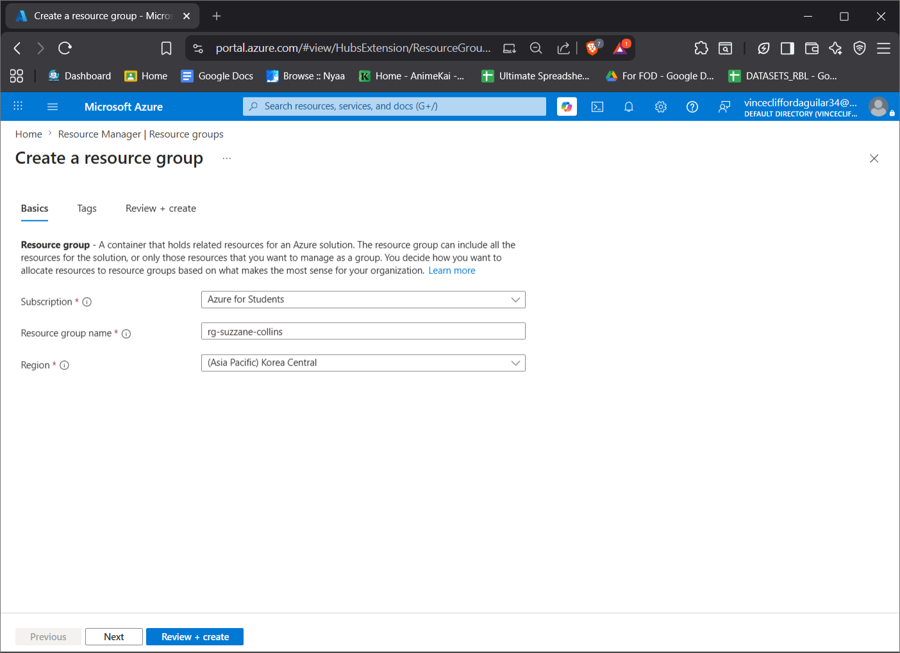

**SS-02** — Completed resource group overview page showing name, region, and subscription.
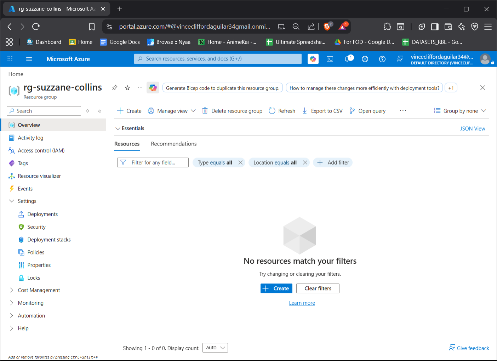

---

## Step 2 – Create the Storage Account

The **Storage Account** will host a Blob container for storing images and media assets used by the web app.

1. In the Azure Portal search bar, type **"Storage accounts"** and click it.
2. Click **+ Create**.
3. Fill in the **Basics** tab:
   - **Subscription:** Azure for Students
   - **Resource group:** `rg-suzzane-collins`
   - **Storage account name:** `sasuzzanecollins` *(must be globally unique, all lowercase, 3–24 chars)*
   - **Region:** `Korea Central`
   - **Performance:** Standard
   - **Redundancy:** Locally-redundant storage (LRS)
4. Leave all other tabs at defaults.
5. Click **Review** → **Create**.
6. Once created, go to the storage account → left menu → **Data storage → Containers**.
7. Click **+ Container**:
   - **Name:** `media`
   - **Public access level:** Blob (anonymous read access for blobs only)
8. Click **Create**.

**SS-03** — The "Create storage account" Basics tab filled in.
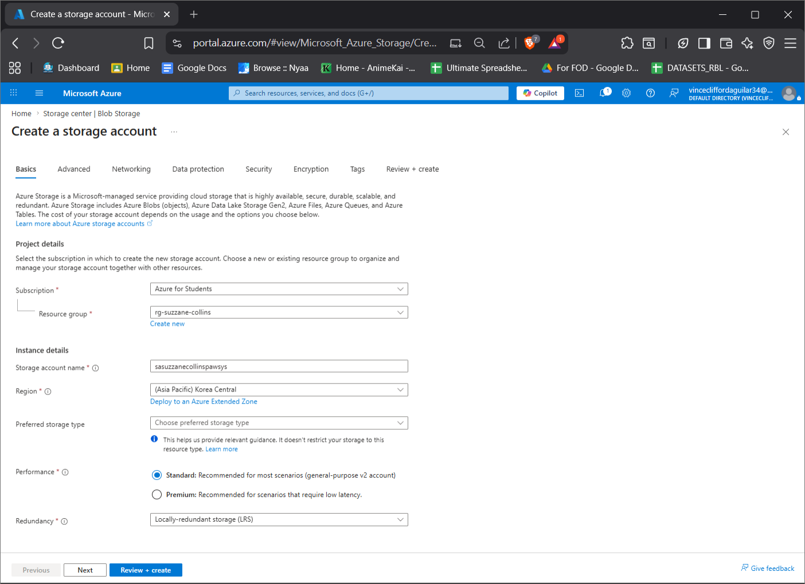

**SS-04** — The storage account Overview page after creation.
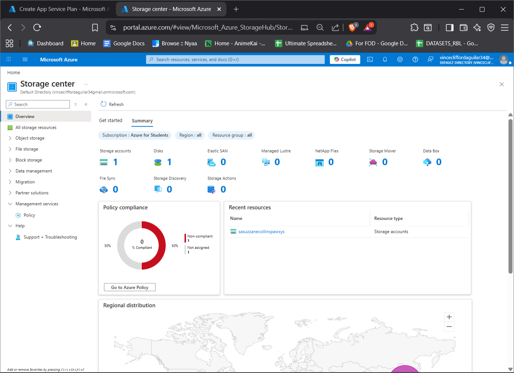

**SS-05** — The `media` container listed under Containers.
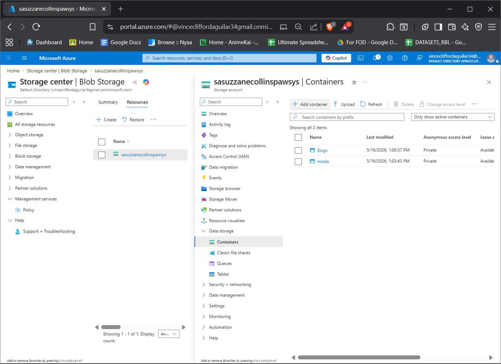

---

## Step 3 – Create the App Service Plan

The **App Service Plan** defines the compute resources (CPU, RAM, region) for your web app.

1. In the search bar, type **"App Service plans"** and click it.
2. Click **+ Create**.
3. Fill in the form:
   - **Subscription:** Azure for Students
   - **Resource group:** `rg-suzzane-collins`
   - **Name:** `asp-suzzane-collins`
   - **Operating System:** Linux
   - **Region:** `Korea Central`
   - **Pricing plan:** Click **Explore pricing plans** → select **B1 Basic** (under "Dev/Test") → Click **Select**.
     > *Note: B1 is ~$13.14/month. If your Azure for Students credit is low, use F1 Free tier — but F1 has limited features (no always-on, no custom domains).*
4. Click **Review + create** → **Create**.

**SS-06** — The "Create App Service Plan" form showing name, OS (Linux), region, and B1 pricing plan selected.
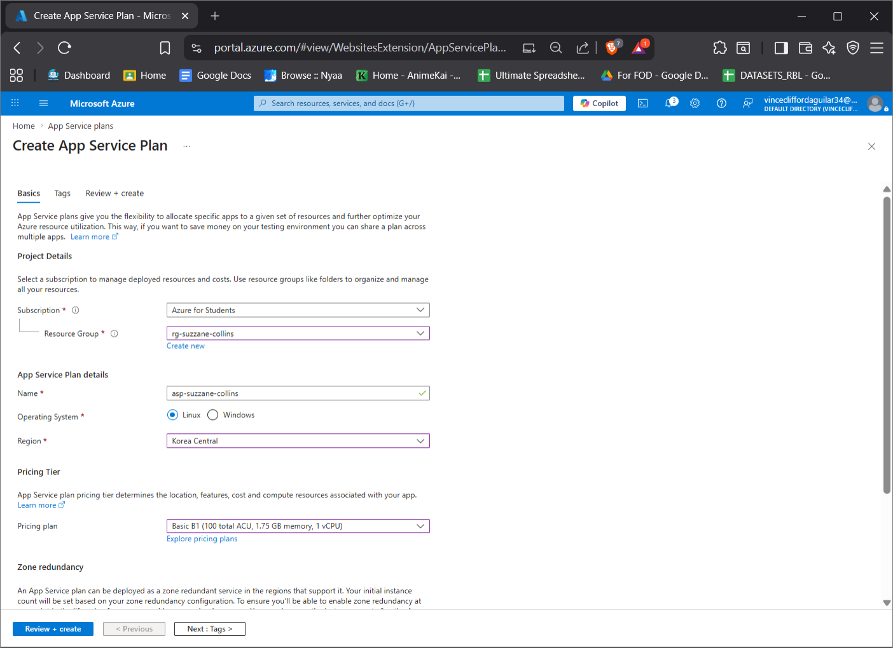

---

## Step 4 – Create the App Service (Web App)

The **App Service** is where your React/Node.js application will actually run.

1. In the search bar, type **"App Services"** and click it.
2. Click **+ Create** → **Web App**.
3. Fill in the **Basics** tab:
   - **Subscription:** Azure for Students
   - **Resource group:** `rg-suzzane-collins`
   - **Name:** `app-suzzane-collins` *(this becomes your URL: `app-suzzane-collins.azurewebsites.net`)*
   - **Publish:** Code
   - **Runtime stack:** Node 20 LTS
   - **Operating System:** Linux
   - **Region:** Korea Central
   - **Linux Plan:** Select `asp-suzzane-collins` (the plan you just created)
4. Go to the **Deployment** tab:
   - **Continuous deployment:** Disable for now (we'll set up GitHub Actions manually in Step 8)
5. Click **Review + create** → **Create**.
6. After creation, go to the App Service overview. Note the **Default domain** URL.

**SS-07** — The "Create Web App" Basics tab with all fields filled in.
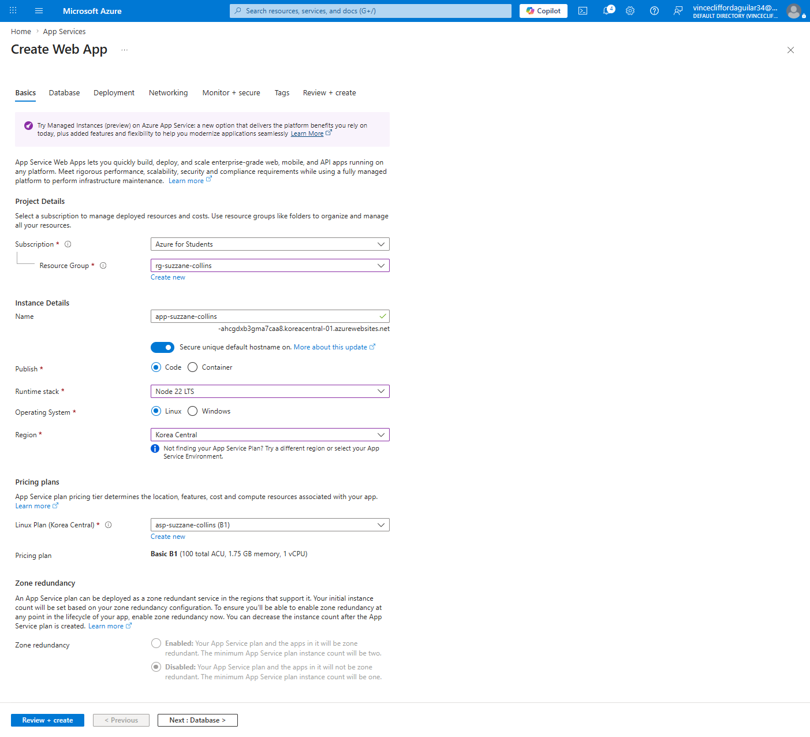

**SS-08** — The App Service Overview page showing the default domain URL.
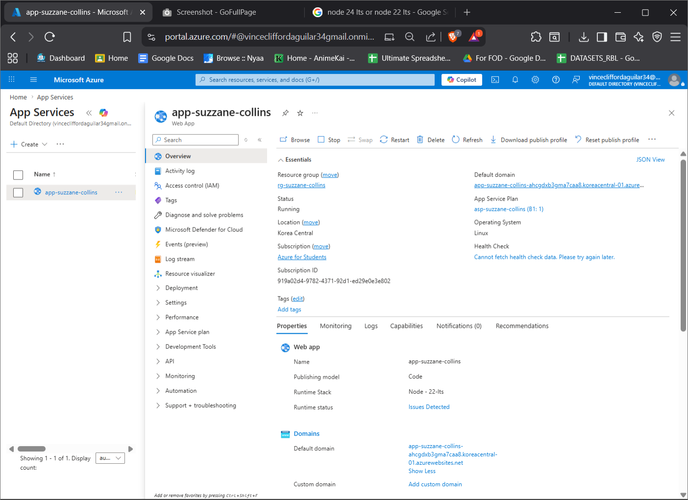

---

## Step 5 – Create the Key Vault (Security Control)

**Azure Key Vault** securely stores the Storage Account connection string so it is never hardcoded in the application code.

1. In the search bar, type **"Key vaults"** and click it.
2. Click **+ Create**.
3. Fill in the **Basics** tab:
   - **Subscription:** Azure for Students
   - **Resource group:** `rg-suzzane-collins`
   - **Key vault name:** `kv-suzzane-collins`
   - **Region:** Korea Central
   - **Pricing tier:** Standard
4. Click **Review + create** → **Create**.
5. Once created, go to your Key Vault → left menu → **Objects → Secrets**.
6. Click **+ Generate/Import**:
   - **Upload options:** Manual
   - **Name:** `StorageConnectionString`
   - **Secret value:** *(paste your Storage Account connection string — see below how to get it)*
     - Go back to your Storage Account → **Security + networking → Access keys** → Copy **Connection string** under `key1`.
   - Click **Create**.

**SS-09** — The "Create a key vault" Basics tab.
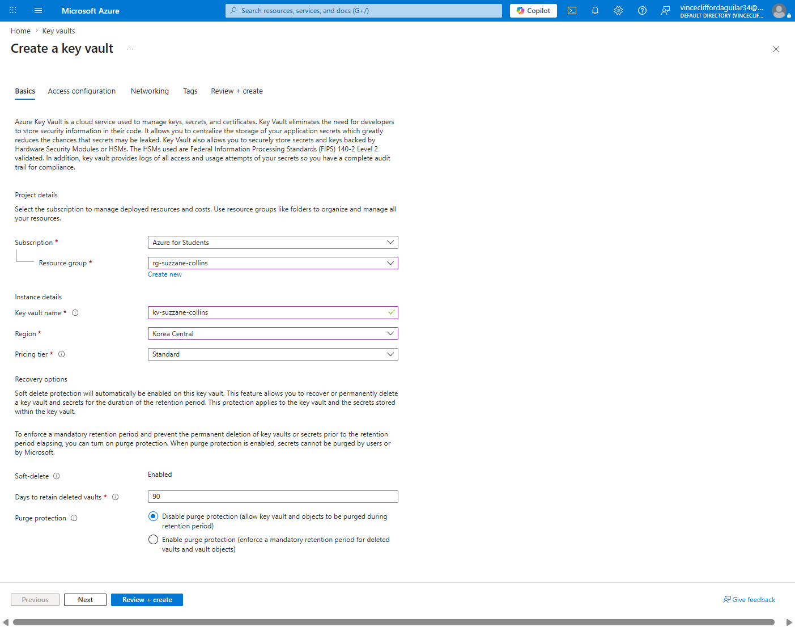

**SS-10** — Key Vault Overview page after creation.
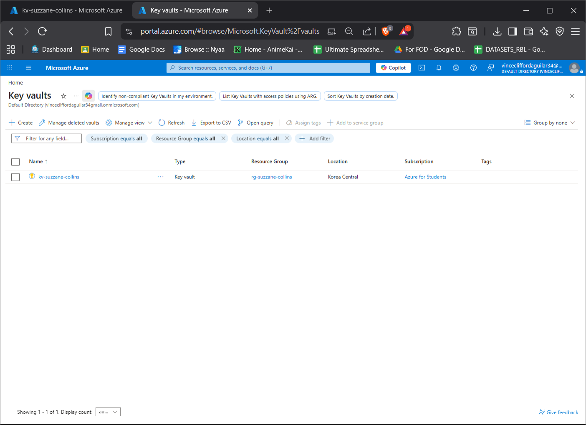

**SS-11** — The `StorageConnectionString` secret listed under Secrets (value hidden).
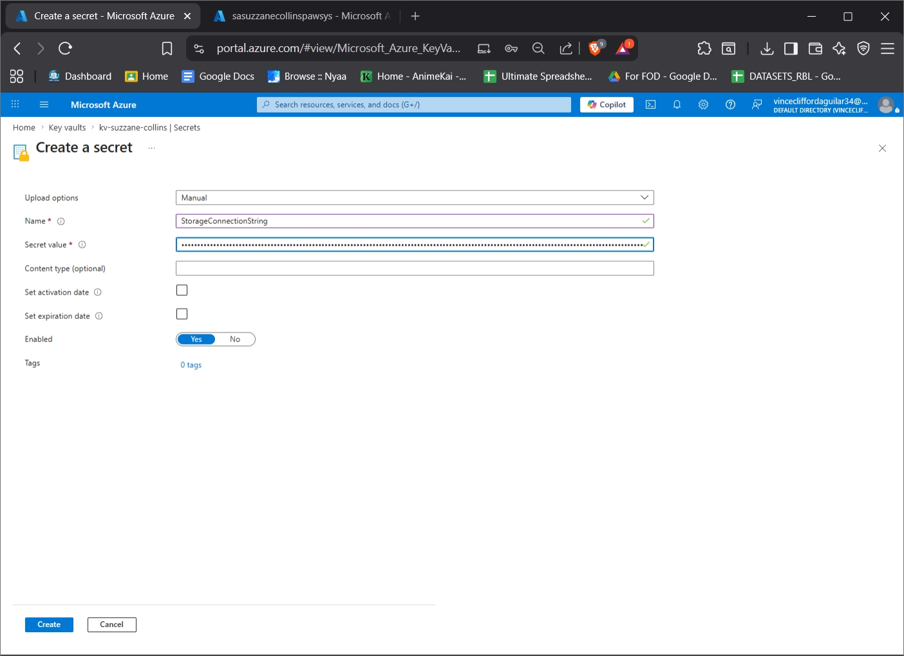

---

## Step 6 – Enable Managed Identity & Grant Key Vault Access

A **Managed Identity** lets the App Service securely access Key Vault without storing any credentials.

### 6a. Enable System-Assigned Managed Identity

1. Go to your **App Service** (`app-suzzane-collins`).
2. In the left menu, go to **Settings → Identity**.
3. Under **System assigned** tab, toggle **Status** to **On**.
4. Click **Save** → confirm with **Yes** when prompted.
5. Note the **Object (principal) ID** that appears — you'll need it next.

**SS-12** — The Identity page with System assigned Status = On and the Object ID visible.
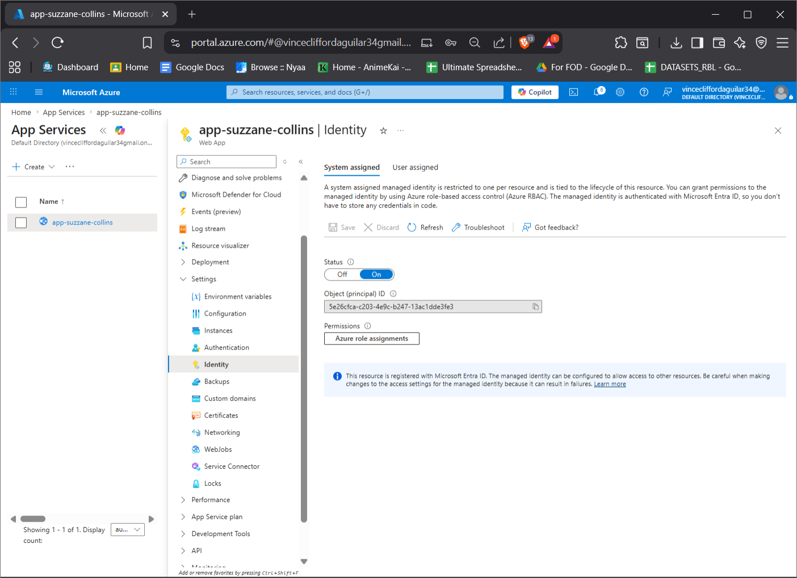

### 6b. Assign Key Vault Secrets User Role

1. Go to your **Key Vault** (`kv-suzzane-collins`).
2. In the left menu, click **Access control (IAM)**.
3. Click **+ Add** → **Add role assignment**.
4. In the **Role** tab, search for **Key Vault Secrets User** → select it → click **Next**.
5. In the **Members** tab:
   - **Assign access to:** Managed identity
   - Click **+ Select members**
   - **Subscription:** Azure for Students
   - **Managed identity:** App Service
   - Select `app-suzzane-collins` → click **Select**
6. Click **Review + assign** → **Review + assign**.

**SS-13** — The Add role assignment page showing "Key Vault Secrets User" role and the App Service managed identity selected.
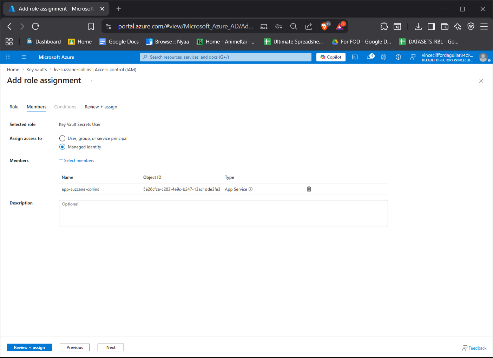

**SS-14** — The IAM Role assignments page showing the new assignment listed.
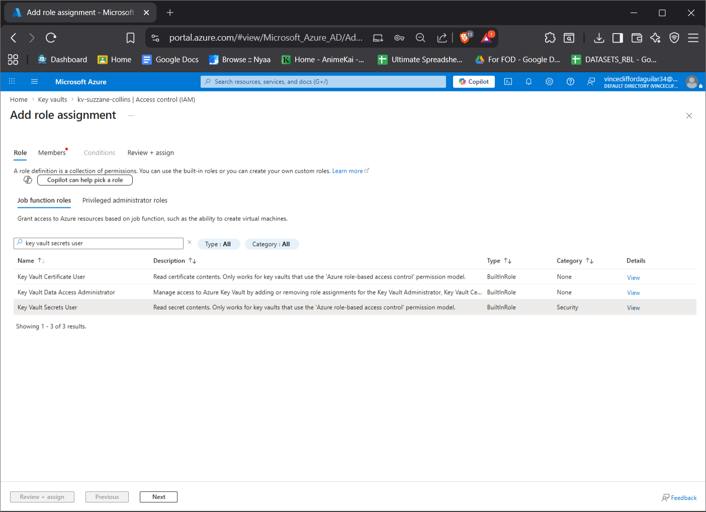

---

## Step 7 – Create Application Insights (Performance & Observability)

**Azure Application Insights** monitors the live performance of the App Service — tracking response times, request rates, failed requests, and exceptions. This is our second cloud optimization: instead of just deploying the app, we add observability so we can detect and diagnose issues in real time.

> ℹ️ *Note: Azure CDN (Microsoft classic) is not available on Azure for Students subscriptions. Application Insights is the chosen alternative — it is always available on Azure for Students and qualifies as a cloud optimization under the Performance & Observability category.*

### 7a. Create the Application Insights Resource

1. In the Azure Portal search bar, type **"Application Insights"** and click it.
2. Click **+ Create**.
3. Fill in the **Basics** tab:
   - **Subscription:** Azure for Students
   - **Resource group:** `rg-suzzane-collins`
   - **Name:** `appi-suzzane-collins`
   - **Region:** Korea Central
   - **Resource Mode:** Workspace-based
   - **Log Analytics Workspace:** Accept the default new workspace, or select an existing one
4. Click **Review + create** → **Create**.
5. After creation, go to the Application Insights resource overview and note the **Instrumentation Key** and **Connection String**.

**SS-15** — The "Create Application Insights" Basics tab with all fields filled in.
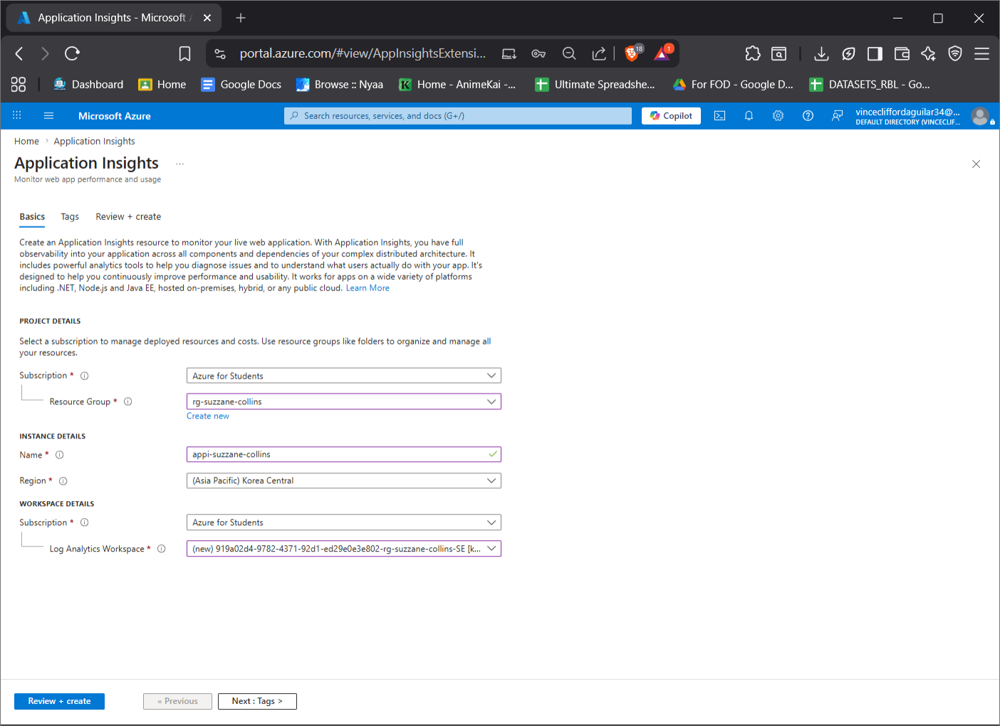

**SS-16** — Application Insights Overview page showing the Instrumentation Key and Connection String.
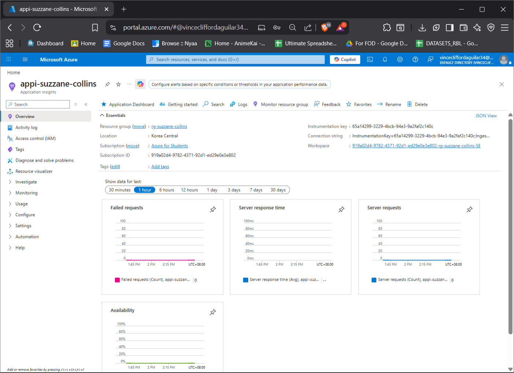

### 7b. Connect Application Insights to the App Service

1. Go to your **App Service** (`app-suzzane-collins`).
2. In the left menu, go to **Settings → Application Insights**.
3. Click **Turn on Application Insights**.
4. Select **Select existing resource** → choose `appi-suzzane-collins`.
5. Leave instrumentation settings at defaults.
6. Click **Apply** → confirm with **Yes** when prompted.

**SS-17** — App Service → Application Insights settings page showing `appi-suzzane-collins` connected and enabled.
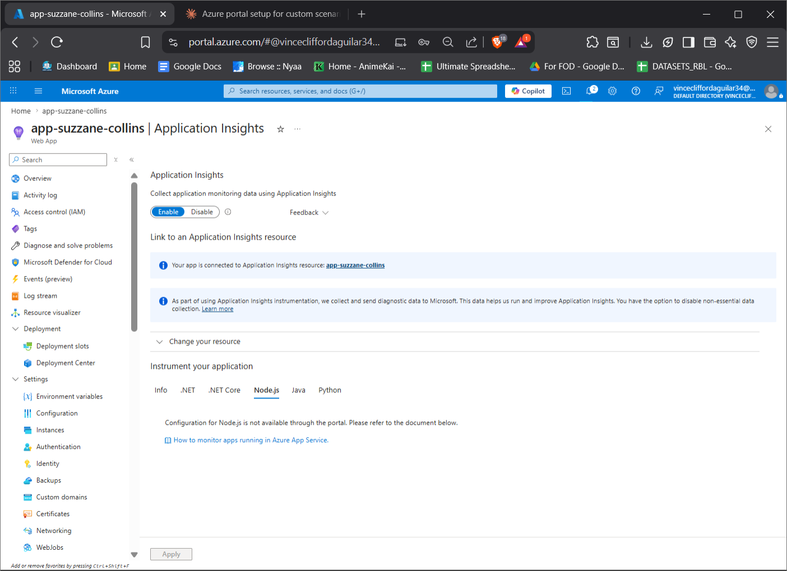

---

## Step 8 – Set Up CI/CD with GitHub Actions

**GitHub Actions** automatically builds and deploys your app every time you push to the `main` branch — eliminating manual deployments.

### 8a. Get the Publish Profile

1. Go to your **App Service** (`app-suzzane-collins`).
2. In the **Overview** page, click **Download publish profile** (top toolbar).
3. Save the `.PublishSettings` file — you'll paste its contents in the next step.

**SS-18** — App Service Overview page with the "Download publish profile" button highlighted.
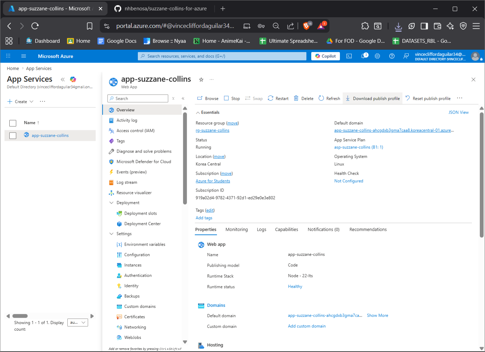

### 8b. Add Publish Profile as GitHub Secret

1. Go to your GitHub repository (`nhbenosa/suzzane-collins-site`).
2. Click **Settings** (top nav) → **Secrets and variables → Actions**.
3. Click **New repository secret**:
   - **Name:** `AZURE_WEBAPP_PUBLISH_PROFILE`
   - **Value:** Paste the entire contents of the `.PublishSettings` file you downloaded.
4. Click **Add secret**.

**SS-19** — GitHub repository Secrets page showing `AZURE_WEBAPP_PUBLISH_PROFILE` listed.
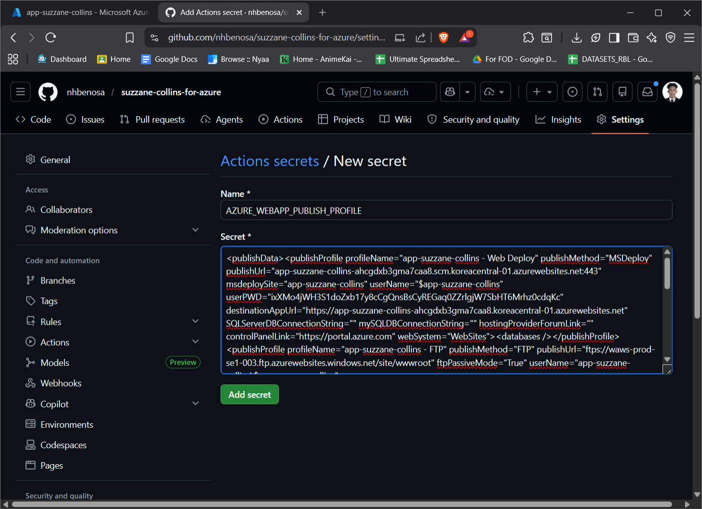

### 8c. Create the GitHub Actions Workflow File

In your repository, create the file `.github/workflows/azure-deploy.yml` with the following content:

```yaml
name: Deploy to Azure App Service

on:
  push:
    branches:
      - main

jobs:
  build-and-deploy:
    runs-on: ubuntu-latest

    steps:
      - name: Checkout code
        uses: actions/checkout@v4

      - name: Set up Node.js
        uses: actions/setup-node@v4
        with:
          node-version: '22'
          cache: 'npm'

      - name: Install dependencies
        run: npm ci

      - name: Build React app
        run: npm run build

      - name: Deploy to Azure Web App
        uses: azure/webapps-deploy@v3
        with:
          app-name: 'app-suzzane-collins'
          publish-profile: ${{ secrets.AZURE_WEBAPP_PUBLISH_PROFILE }}
          package: ./build
```

Commit and push this file to `main`. Go to your GitHub repo → **Actions** tab to watch the workflow run.

**SS-20** — GitHub Actions tab showing the workflow run in progress or completed (green checkmark).
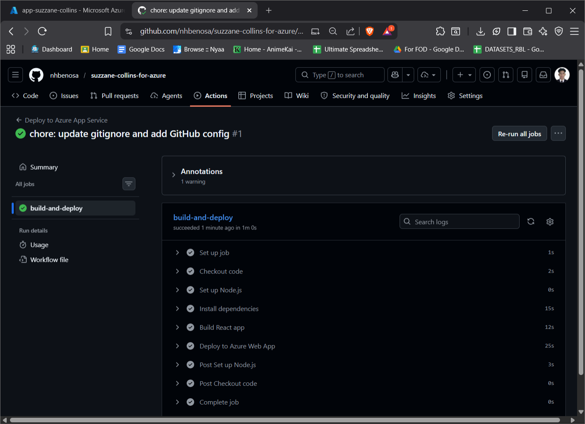

**SS-21** — The deployed application running in a browser at `https://app-suzzane-collins-ahcgdxb3gma7caa8.koreacentral-01.azurewebsites.net/`.
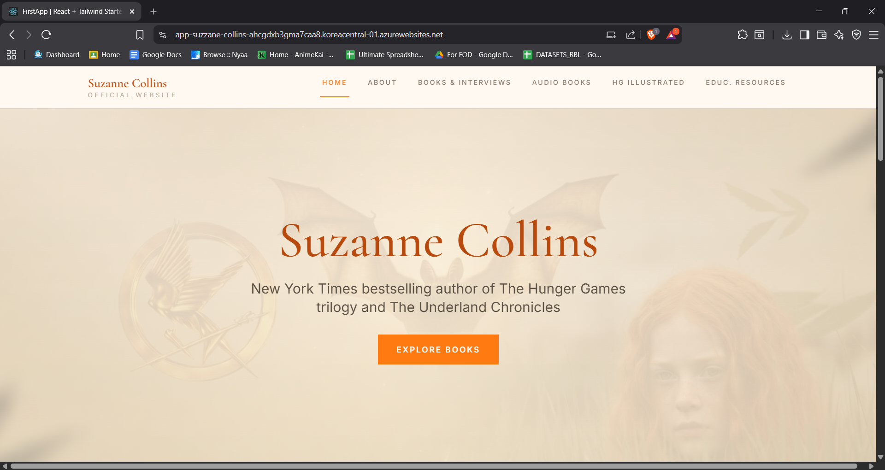

---

## Step 9 – Configure App Service Startup Command

Since we're deploying the built React files (static HTML/JS/CSS), set the startup command so Azure serves them correctly.

1. Go to your **App Service** → **Settings → Configuration**.
2. Click the **General settings** tab.
3. Set **Startup Command** to:
   ```
   npx serve -s . -l 8080
   ```
   > *This uses the `serve` package to host the static build output from the root of the deployment directory. Note: GitHub Actions deploys the **contents** of `/build` directly to `wwwroot`, not the folder itself — so serve from `.` not `build`.*
4. Click **Save**. Then go to **Overview → Restart** to apply the change.

**SS-22** — App Service Configuration → General settings showing the startup command set.
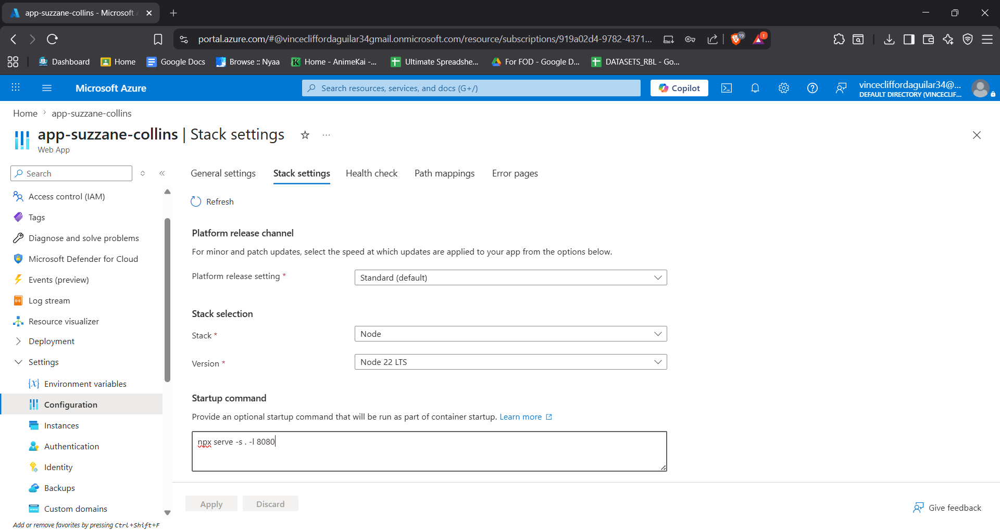

---

## Summary of All Azure Resources Created

| Resource | Name | Region |
|----------|------|--------|
| Resource Group | `rg-suzzane-collins` | Korea Central |
| Storage Account | `sasuzzanecollins` | Korea Central |
| App Service Plan | `asp-suzzane-collins` (B1, Linux) | Korea Central |
| App Service | `app-suzzane-collins` (Node 20 LTS) | Korea Central |
| Key Vault | `kv-suzzane-collins` (Standard) | Korea Central |
| Application Insights | `appi-suzzane-collins` (Workspace-based) | Korea Central |

---

## Cloud Optimizations Summary

| # | Optimization | Category | How Implemented |
|---|-------------|----------|-----------------|
| 1 | GitHub Actions CI/CD | DevOps Automation | `.github/workflows/azure-deploy.yml` auto-deploys on every push to `main` |
| 2 | Application Insights | Performance & Observability | Monitors live app performance — response times, failure rates, and exceptions — connected to App Service via instrumentation key |

---

## Screenshots Checklist

| # | File | Description |
|---|------|-------------|
| SS-01 | `SS-01-rg-create-form.png` | Resource Group creation form |
| SS-02 | `SS-02-rg-overview.png` | Resource Group overview after creation |
| SS-03 | `SS-03-storage-create.png` | Storage Account creation form |
| SS-04 | `SS-04-storage-overview.png` | Storage Account overview |
| SS-05 | `SS-05-blob-container.png` | `media` container created |
| SS-06 | `SS-06-asp-create.png` | App Service Plan creation with B1 selected |
| SS-07 | `SS-07-webapp-create.png` | Web App creation Basics tab |
| SS-08 | `SS-08-webapp-overview.png` | Web App overview with default domain |
| SS-09 | `SS-09-keyvault-create.png` | Key Vault creation form |
| SS-10 | `SS-10-keyvault-overview.png` | Key Vault overview |
| SS-11 | `SS-11-secret-created.png` | StorageConnectionString secret listed |
| SS-12 | `SS-12-managed-identity.png` | System-assigned identity enabled with Object ID |
| SS-13 | `SS-13-iam-role-assign.png` | Role assignment form — Key Vault Secrets User |
| SS-14 | `SS-14-iam-assigned.png` | IAM page showing role assigned |
| SS-15 | `SS-15-appinsights-create.png` | Application Insights creation form |
| SS-16 | `SS-16-appinsights-overview.png` | Application Insights overview with Instrumentation Key |
| SS-17 | `SS-17-appinsights-connected.png` | App Service → Application Insights settings showing connected |
| SS-18 | `SS-18-publish-profile.png` | App Service publish profile download |
| SS-19 | `SS-19-github-secret.png` | GitHub Actions secret added |
| SS-20 | `SS-20-gha-workflow.png` | GitHub Actions workflow run result |
| SS-21 | `SS-21-live-app.png` | Live deployed app in browser |
| SS-22 | `SS-22-startup-command.png` | App Service startup command configured |

