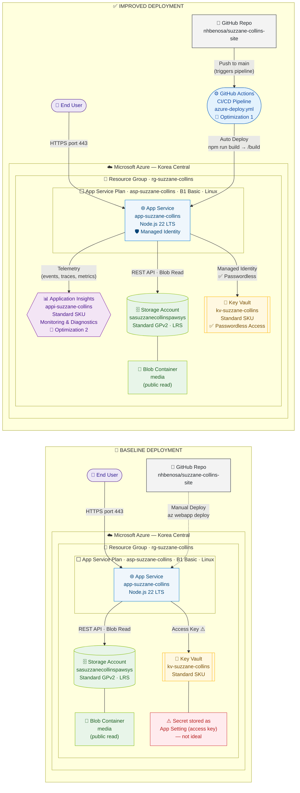

# Architecture Diagram — Suzanne Collins Fan Site on Azure

**Course:** CSEC 3 – Cloud Computing | **Scenario:** E – Custom Web Application
**Region:** Korea Central (Korea) | **Method:** Method B (GUI)

> This diagram shows the **Baseline Deployment** (left) and **Improved Deployment** (right).
> GitHub renders Mermaid diagrams natively — no extra tools needed.

---

---

## Cloud Optimizations

| # | Optimization | Category | Description |
|---|-------------|----------|-------------|
| 🔵 1 | **GitHub Actions CI/CD** | DevOps Automation | Every push to `main` automatically builds (`npm run build`) and deploys to Azure App Service. Eliminates manual `az webapp deploy` commands and reduces human error. |
| 🔵 2 | **Application Insights** | Monitoring & Observability | Collects telemetry data from the App Service including request traces, performance metrics, exceptions, and custom events. Enables real-time diagnostics and alerting for application health and performance monitoring. |

## Security Boundary

| Zone | Resources |
|------|-----------|
| 🔓 **Public Internet** | App Service endpoint (`app-suzzane-collins.azurewebsites.net`) |
| 🔒 **Azure Internal** | Key Vault (no public credential exposure), Storage Account (accessed via REST API internally), Managed Identity (system-assigned, no secret stored) |

## Resources Summary

| Service | Resource Name | SKU / Tier | Purpose |
|---------|--------------|------------|---------|
| Resource Group | `rg-suzzane-collins` | — | Container for all resources |
| App Service Plan | `asp-suzzane-collins` | B1 Basic, Linux | Compute tier |
| App Service | `app-suzzane-collins` | Node.js 22 LTS | Hosts the React web app |
| Storage Account | `sasuzzanecollinspawsys` | Standard GPv2, LRS | Stores media assets |
| Blob Container | `media` | Public read (blobs) | Serves images and files |
| Key Vault | `kv-suzzane-collins` | Standard SKU | Stores connection strings securely |
| Managed Identity | System-assigned | — | Passwordless auth to Key Vault |
| Application Insights | `appi-suzzane-collins` | Standard SKU | Monitors app performance and diagnostics |
| GitHub Actions | `azure-deploy.yml` | — | CI/CD auto-deployment pipeline |
