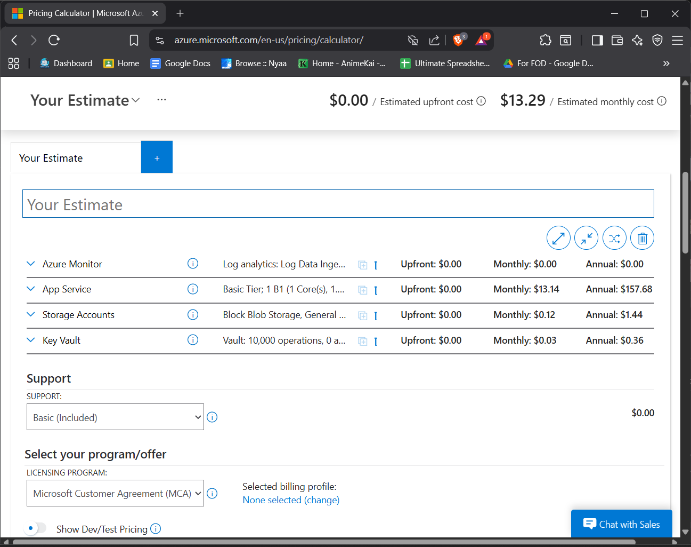

# Cost Estimate Report

**Project:** Suzanne Collins Fan Site – Azure Cloud Deployment
**Course:** CSEC 3 – Cloud Computing
**Prepared using:** [Azure Pricing Calculator](https://azure.microsoft.com/en-us/pricing/calculator/)

---

## 1. Architecture Summary

The Suzanne Collins Fan Site is deployed on Microsoft Azure using the following resources:

- **Azure App Service (B1, Linux)** — Hosts the React/Node.js web application. The B1 Basic tier provides 1 core, 1.75 GB RAM, and 10 GB storage, suitable for a small-to-medium traffic website.
- **Azure Storage Account (LRS, Standard GPv2)** — Provides Blob Storage for hosting media assets (images, downloadable files). Uses Locally Redundant Storage for cost-effective durability within a single region.
- **Azure Key Vault (Standard SKU)** — Stores the Storage Account connection string as a secret. Accessed by the App Service via Managed Identity with no credentials stored in code.
- **Azure Application Insights (Workspace-based)** — Monitors live application performance including response times, request rates, failed requests, and exceptions. Connected to the App Service via instrumentation key. Replaces Azure CDN (Microsoft classic), which is unavailable on Azure for Students subscriptions.

All resources are deployed in the **Korea Central** (Korea) region.

---

## 2. Itemized Monthly Cost Breakdown

| # | Service | Configuration | Est. Monthly Cost (USD) |
|---|---------|---------------|------------------------|
| 1 | **App Service Plan** | B1 Basic, Linux, Korea Central, 1 instance | ~$13.14 |
| 2 | **Azure Storage Account** | Standard GPv2, LRS, 5 GB storage, 10,000 read ops, 1,000 write ops | ~$0.12 |
| 3 | **Azure Key Vault** | Standard, 10,000 secret operations/month | ~$0.03 |
| 4 | **Application Insights** | Workspace-based, first 5 GB/month data ingestion free | ~$0.00 |
| | | **Estimated Total** | **~$13.29 / month** |

> ⚠️ *These are estimates. Actual costs depend on traffic, data transfer volumes, and Azure pricing changes. Free tier allowances from Azure for Students may reduce or eliminate some charges.*

---

## 3. Azure Pricing Calculator Screenshot

> *Screenshot of the Azure Pricing Calculator showing all resources and the monthly total. Save your screenshot as `report/pricing-calculator.png` to display it here.*

---

## 4. Cost Optimization Notes

### Strategy 1: Use App Service Free (F1) Tier During Development
The **F1 Free tier** ($0/month) can replace the B1 Basic tier during development and testing phases. Switching to F1 eliminates the ~$13.14/month App Service cost entirely. The trade-off is F1 does not support "Always On" (app sleeps after inactivity) and has a 60-minute/day compute limit. **Estimated savings: ~$13.14/month during development.**

### Strategy 2: Scale Down / Stop Resources When Not in Use
Azure allows you to **stop** an App Service when the site isn't being accessed (e.g., outside class hours or after grading). A stopped App Service is not billed for compute. You are only billed for the storage component. **Estimated savings: ~$10–$13/month if stopped 75% of the time.**

### Strategy 3: Switch to Azure Static Web Apps (Free Tier)
Since the Suzanne Collins site is a static React application (no server-side logic), it could be entirely re-deployed as an **Azure Static Web App** on the **Free tier** ($0/month). Azure Static Web Apps includes built-in CI/CD, global CDN, and custom domains at no cost for small projects. This would eliminate the App Service Plan and App Service costs entirely. **Estimated savings: ~$13.14/month.**

---

## 5. Summary

| Scenario | Estimated Monthly Cost |
|----------|----------------------|
| Current deployment (B1 + Storage + Key Vault + Application Insights) | **~$13.29/month** |
| With F1 Free tier instead of B1 | **~$0.15/month** |
| Fully migrated to Azure Static Web Apps (Free) | **~$0.15/month** |

Given that this project uses **Azure for Students** credits ($100 total), the current B1 deployment is sustainable for approximately **7 months** before credits are exhausted.

> ℹ️ **Note on Application Insights cost:** Azure Application Insights includes **5 GB of data ingestion per month at no cost**. For a low-traffic student project, actual ingestion will be well under this limit, making Application Insights effectively free for this deployment.
